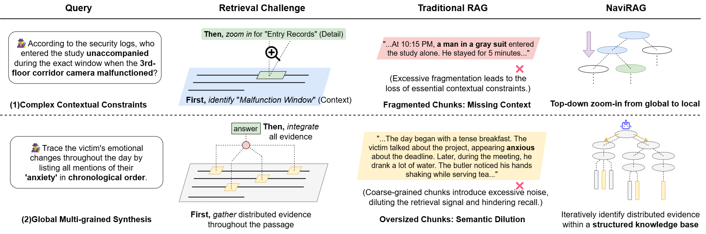

<div align="center">
<h1> NaviRAG: Towards Active Knowledge Navigation for Retrieval-Augmented Generation
<h5 align="center"> 
  
<a href='xxx'></a>


Jihao Dai<sup>1,2</sup>,
Dingjun Wu<sup>1</sup>,
Yuxuan Chen<sup>1</sup>,
Zheni Zeng<sup>2</sup>,
Yukun Yan<sup>1</sup>,
Zhenghao Liu<sup>3</sup>,
Maosong Sun<sup>1</sup>,


<sup>1</sup>Tsinghua University, <sup>2</sup>Nanjing University, <sup>3</sup>Northeastern University

</h5>
</div>


## 📖 Introduction/Overview
NaviRAG is a navigation-based Retrieval-Augmented Generation (RAG) framework designed for complex reasoning question answering. Existing RAG research primarily focuses on cross-document retrieval and multi-hop information integration, approximating reasoning as the localization and aggregation of dispersed facts. However, in complex long-chain reasoning scenarios, queries are constrained by explicit contextual conditions, and the required evidence is distributed across different semantic levels of a text. The relationship between evidence and queries is jointly governed by contextual semantics, thereby imposing higher demands on retrieval mechanisms.
<p align="center">
  
</p>
Inspired by Information Foraging Theory, NaviRAG models evidence acquisition as a multi-stage, navigable, and dynamic exploration process. The framework constructs a hierarchical semantic representation grounded in traceable raw text and adopts a staged retrieval strategy of “locate first, then forage.” It first identifies relevant semantic subspaces within the knowledge base and subsequently performs coarse-to-fine, multi-step navigational retrieval to progressively acquire evidence. This design enables efficient adaptation to queries of varying granularity while supporting context-sensitive retrieval.
<p align="center">
  
</p>

Extensive experiments on multiple complex reasoning question answering benchmarks demonstrate that NaviRAG achieves significant performance improvements over mainstream RAG methods while maintaining competitive reasoning costs.


## 🚧 Code Availability

The codebase is currently under active organization. It will be released and documented in this repository as soon as it is ready.

## 🥰 Citation
```
@article{chen2025ultrarag,
  title={UltraRAG: A Modular and Automated Toolkit for Adaptive Retrieval-Augmented Generation},
  author={Chen, Yuxuan and Guo, Dewen and Mei, Sen and Li, Xinze and Chen, Hao and Li, Yishan and Wang, Yixuan and Tang, Chaoyue and Wang, Ruobing and Wu, Dingjun and others},
  journal={arXiv preprint arXiv:2504.08761},
  year={2025}
}
```


