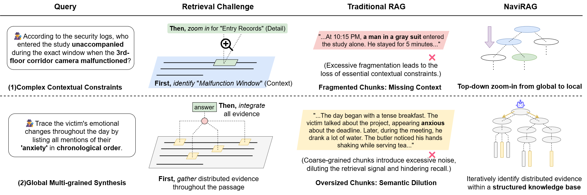
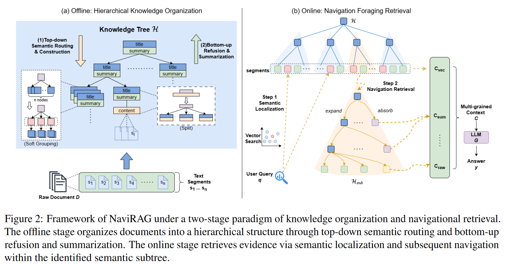

<div align="center">
<h1> NaviRAG: Towards Active Knowledge Navigation for Retrieval-Augmented Generation
<h5 align="center"> 


<a href='https://arxiv.org/abs/2604.12766'></a>


Jihao Dai<sup>1,2</sup>,
Dingjun Wu<sup>1</sup>,
Yuxuan Chen<sup>1</sup>,
Zheni Zeng<sup>2</sup>,
Yukun Yan<sup>1</sup>,
Zhenghao Liu<sup>3</sup>,
Maosong Sun<sup>1</sup>,


<sup>1</sup>Tsinghua University, <sup>2</sup>Nanjing University, <sup>3</sup>Northeastern University

</h5>
</div>


## 📖 Introduction/Overview

NaviRAG is a navigation-based Retrieval-Augmented Generation (RAG) framework designed for complex reasoning question answering. Existing RAG research primarily focuses on cross-document retrieval and multi-hop information integration, approximating reasoning as the localization and aggregation of dispersed facts. However, in complex long-chain reasoning scenarios, queries are constrained by explicit contextual conditions, and the required evidence is distributed across different semantic levels of a text. The relationship between evidence and queries is jointly governed by contextual semantics, thereby imposing higher demands on retrieval mechanisms.

<p align="center">
  
</p>

Inspired by Information Foraging Theory, NaviRAG models evidence acquisition as a multi-stage, navigable, and dynamic exploration process. The framework constructs a hierarchical semantic representation grounded in traceable raw text and adopts a staged retrieval strategy of “locate first, then forage.” It first identifies relevant semantic subspaces within the knowledge base and subsequently performs coarse-to-fine, multi-step navigational retrieval to progressively acquire evidence. This design enables efficient adaptation to queries of varying granularity while supporting context-sensitive retrieval.

<p align="center">
  
</p>


Extensive experiments on multiple complex reasoning question answering benchmarks demonstrate that NaviRAG achieves significant performance improvements over mainstream RAG methods while maintaining competitive reasoning costs.

## Code Usage

### Project Structure

```text
```text
NaviRAG/
├── assets/
│   ├── intro.png
│   └── method.png
├── dataset/
│   ├── longbenchv2/
│   │   ├── sub_domain_docs.jsonl
│   │   └── sub_domain_qa.jsonl
│   ├── loogle/
│   │   ├── long_sc_docs.jsonl
│   │   ├── long_sc_qa.jsonl
│   │   ├── long_wp_docs.jsonl
│   │   ├── long_wp_qa.jsonl
│   │   ├── short_500_docs.jsonl
│   │   └── short_500_qa.jsonl
│   └── narrative/
│       ├── hpr2_10_doc.jsonl
│       └── hpr2_10_qa.jsonl
├── offline_generation/
│   ├── config.yaml
│   ├── gen_knowledge_base.py
│   ├── gen_prompts.json
│   ├── gen_utils.py
│   ├── postprocess.py
│   └── run_generation_pipeline.py
├── online_retrieval/
│   ├── evaluate.py
│   ├── LLM.py
│   ├── main.py
│   ├── navigation.py
│   ├── prompts.json
│   ├── retrieval_pipeline.py
│   └── utiles.py
├── .gitignore
├── LICENSE
├── README.md
└── requirements.txt
```

```

### Installation

Install the required packages:

```bash
pip install -r requirements.txt
```

For reproduction with a local LLM server, installing vLLM is recommended:

```bash
pip install vllm
```

Package versions are not pinned because compatible PyTorch, CUDA, FAISS, and vLLM versions depend on the local environment.

For API-based generation, set:

```bash
export OPENAI_API_KEY="your-api-key"
```

An API key is required for the Loogle LLM-as-a-Judge evaluation.

------

## Offline Knowledge Base Generation

### Input Format

The source data must be stored as JSONL, with one document per line:

```json
{
  "id": "document-id",
  "title": "Document title",
  "content": "Document content"
}
```

### Configuration

Edit `offline_generation/config.yaml` before running the offline pipeline:

```
config_version: 1

paths:
  input_file_path: /path/to/documents.jsonl
  output_dir: /path/to/output_directory
  prompt_path: /path/to/wiki_prompts.json

general:
  language: English

segmentation:
  max_words_per_segment: 512
  overlap_rate: 0.2
  save_segments: true

models:
  is_vllm: true
  model_path: /path/to/llm
  gpt_model: deepseek-v3
  embedding_path: /path/to/embedding_model
  embedding_device: cuda:0

output:
  group_output_by_title: true
  merge_similar_topics: false
  similarity_threshold: 0.8

batching:
  # Documents with more segments are split into sub-documents and merged later.
  max_sub_batch_size: 250
  # Resume generation from a specific batch.
  start_batch_id: 0

parallelism:
  enable_document_parallelism: true
  max_concurrency: 32
  enable_sub_batch_parallelism: true

generation:
  max_leaf_tokens: 1536
  max_topics_per_level: 12
  # Requested number of relevant topics in the prompt.
  selected_topic_count: 2
  # Maximum retained topics when the model exceeds the requested number.
  max_selected_topics: 4
  # Number of segments filled into the outline per generation step.
  summary_batch_size: 10
  new_topic_parse_retries: 3

postprocessing:
  dataset: narrative
  prompt_path: /path/to/postprocessing_prompts.json
  summary_max_input_tokens: 8192
  leaf_rewrite_retries: 1
  vector_batch_size: 8
  overwrite_existing: true
```

When `models.is_vllm` is enabled, `model_path` should match the model path used to launch the vLLM server. When it is disabled, `gpt_model` specifies the API model.

### Run

```bash
cd offline_generation
python run_generation_pipeline.py --config /path/to/config.yaml
```

The generated knowledge base is written to the `output_dir` configured in `config.yaml`:

```text
output_dir/
├── wiki_ori.jsonl
├── segments.jsonl
├── sum.json
├── ud_wiki.jsonl
├── chunks.json
├── v_chunks.json
└── v_index.faiss
```

------

## Online Retrieval

### Input Format

The QA data must be stored as JSONL and contain at least a `query` field:

```
{"query": "Question text"}
```

An `answer` field may be included for evaluation:

```
{"query": "Question text", "answer": "Reference answer"}
```

### Run

```
cd online_retrieval

python main.py \
  --wRAG_line navirag \
  --qa_data_path /path/to/qa.jsonl \
  --data_dir /path/to/knowledge_base \
  --save_path /path/to/predictions.jsonl
```

Main arguments:

| Argument                     | Description                                                  |
| ---------------------------- | ------------------------------------------------------------ |
| `--wRAG_line`                | Retrieval mode: `vanilla`, `navirag`, or `note`.             |
| `--qa_data_path`             | Input QA JSONL file.                                         |
| `--data_dir`                 | Knowledge base directory generated by the offline pipeline.  |
| `--save_path`                | Output prediction JSONL file.                                |
| `--top_k`                    | Number of retrieved results. Default: `5`.                   |
| `--dataset`                  | Dataset name. Default: `narrative`.                          |
| `--is_vllm` / `--no-is_vllm` | Enable or disable the vLLM backend. Enabled by default.      |
| `--vllm_model_path`          | Local model path in vLLM mode or model name in API mode.     |
| `--embedding_model`          | Embedding model path or identifier.                          |
| `--prompt_template_path`     | Retrieval prompt file.                                       |
| `--is_lc` / `--no-is_lc`     | Enable or disable document-restricted long-context retrieval. Enabled by default. |
| `--max_tokens`               | Maximum context length used for final answer generation. Default: `8192`. |

Available retrieval modes:

| Mode      | Description                                          |
| --------- | ---------------------------------------------------- |
| `vanilla` | Vanilla RAG baseline.                                |
| `navirag` | The proposed NaviRAG method.                         |
| `note`    | Experimental NaviRAG mode with note-based retrieval. |

Example using an API model instead of vLLM:

```
python main.py \
  --wRAG_line navirag \
  --qa_data_path /path/to/qa.jsonl \
  --data_dir /path/to/knowledge_base \
  --save_path /path/to/predictions.jsonl \
  --no-is_vllm \
  --vllm_model_path gpt-4o
```

The output file contains one JSON object per line:

```
{
  "prediction": "Generated answer",
  "context": "Retrieved context"
}
```

---

## Evaluation

Run evaluation from `online_retrieval`:

```bash
cd online_retrieval
```

The prediction file and QA file are aligned by line number.

### Narrative

The `answer` field must be a list of acceptable answers:

```json
{
  "query": "Question text",
  "answer": ["Answer one", "Alternative answer"]
}
```

Run:

```bash
python evaluate.py \
  --prediction-file /path/to/predictions.jsonl \
  --qa-file /path/to/qa.jsonl \
  --dataset narrative
```

Reported metrics:

- F1
- Recall
- Exact Match

### Loogle

The `answer` field must be a string:

```json
{
  "query": "Question text",
  "answer": "Reference answer"
}
```

Set the API key and run:

```bash
export OPENAI_API_KEY="your-api-key"

python evaluate.py \
  --prediction-file /path/to/predictions.jsonl \
  --qa-file /path/to/qa.jsonl \
  --dataset loogle \
  --judge-model gpt-4o
```

`gpt-4o` is the default judge model.

### LongBench v2

The `answer` field must contain the correct option:

```json
{
  "query": "Question text",
  "answer": "C"
}
```

Run:

```bash
python evaluate.py \
  --prediction-file /path/to/predictions.jsonl \
  --qa-file /path/to/qa.jsonl \
  --dataset lbv2
```

The reported metric is accuracy.

## 🥰 Citation

```
@misc{dai2026naviragactiveknowledgenavigation,
      title={NaviRAG: Towards Active Knowledge Navigation for Retrieval-Augmented Generation}, 
      author={Jihao Dai and Dingjun Wu and Yuxuan Chen and Zheni Zeng and Yukun Yan and Zhenghao Liu and Maosong Sun},
      year={2026},
      eprint={2604.12766},
      archivePrefix={arXiv},
      primaryClass={cs.CL},
      url={https://arxiv.org/abs/2604.12766}, 
}
```
